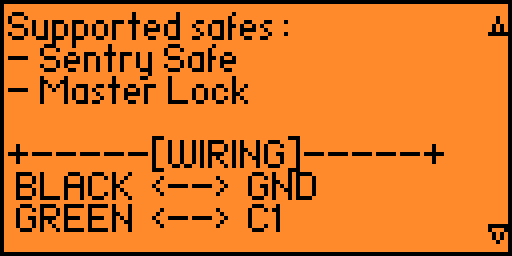

# Sentry Safe - Flipper Zero Plugin

Plugin exploiting vulnerability to open any **Sentry Safe** or **Master Lock** electronic safes.

🔓 Based on the vulnerability described [here](https://github.com/H4ckd4ddy/bypass-sentry-safe)




## 📦 Installation

👉 The plugin is now directly available via the **Flipper Zero Plugin Manager**:  
[Install from the official Flipper app catalog](https://lab.flipper.net/apps/gpio_sentry_safe)

**Steps:**

1. Open the Flipper Zero **Plugin Manager** on your device (smartphone or browser).
2. Search for **Sentry Safe**.
3. Tap **Install**
4. Launch it from the menu on your Flipper.


## 🛠 Usage

1. Launch the **Sentry Safe** plugin.
2. Long-press **OK** to open the help menu (navigate with Up/Down).
3. Place GPIO wires as shown in the help section.
4. On the main interface:
   - Chose your 5-digit code (or use the default).
   - Select code type:
     - `P` → Primary code
     - `S` → Secondary code
5. Press **OK** to send payload.
6. The safe should emit a beep and unlock.

> You can enter `00000` to clear selected code.


## 🧰 Manual Build (Optional)

If you prefer to build manually:

1. Clone your target firmware repo (official or custom) with submodules.
2. Clone this plugin into the `applications_user/` directory:
   ```bash
   git clone https://github.com/H4ckd4ddy/flipperzero-sentry-safe-plugin applications_user/flipperzero-sentry-safe-plugin
   ```
3. Build using `fbt`:
   ```bash
   ./fbt faps APPSRC=applications_user/flipperzero-sentry-safe-plugin
   ```
4. Retrieve the `.fap` file from the `dist/` directory.

For more info on the build tool, see the [official documentation](https://github.com/flipperdevices/flipperzero-firmware/blob/dev/documentation/fbt.md).


## 🙏 Thanks

Thanks to [ArsLock](https://www.linkedin.com/in/arslock-lumes-38aba030a/) for the tips and advice.
